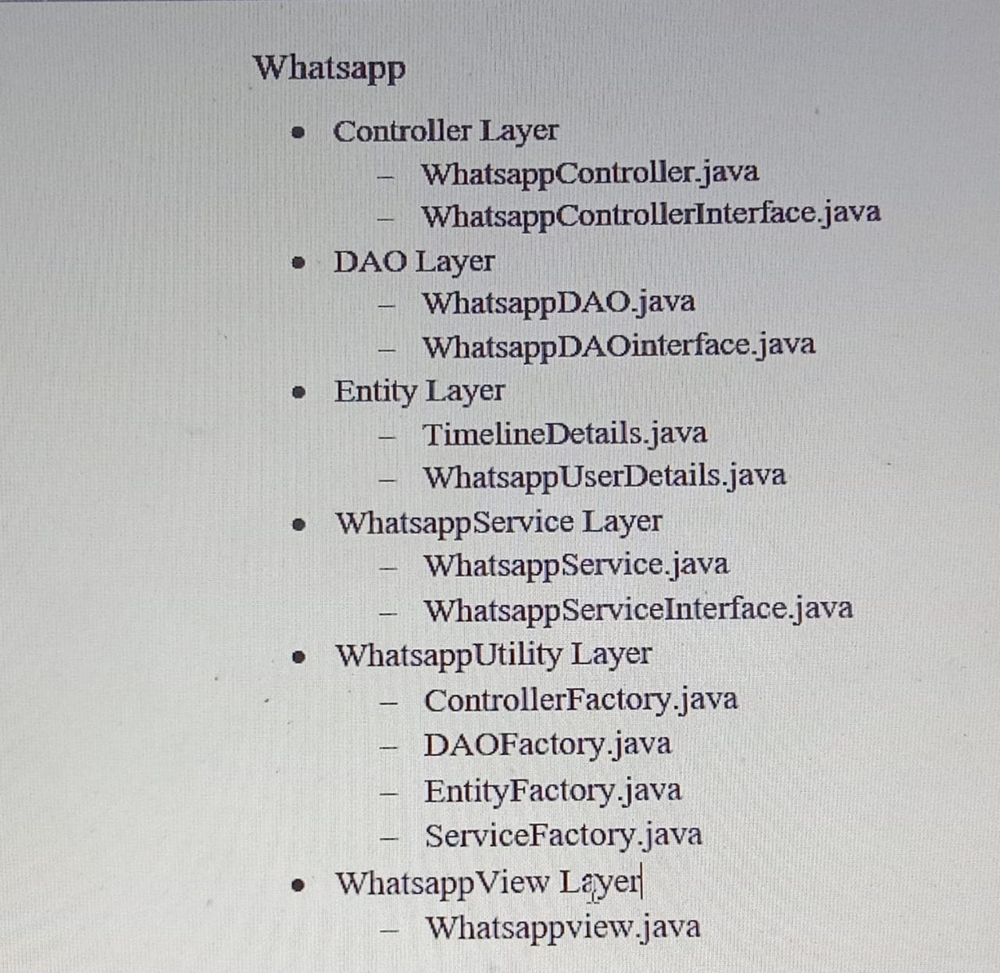

## Whatsapp
This Project is like telegram and here we will implement 8 functionalities like
1. Sign-UP
    - Create Profile
2. Sign-IN
    - Delete Profile
    - View Profile
    - View All Profiles
        - Sort by Name
        - Sort by Address
    - Edit Profile
    - Search Profile
        - Sort by Name
        - Sort by Address
    - Timeline

## Project-Struture

## Software Requirements of the project
1. Java 1.8
2. Oracle
3. Eclipse

## To run this file go to the given path
[Run Whatsapp View](whatsappdivya/src/main/java/com/whatsapp/view/Whatsappview.java)
